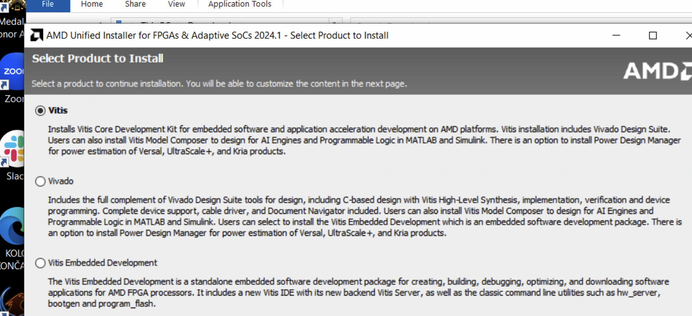
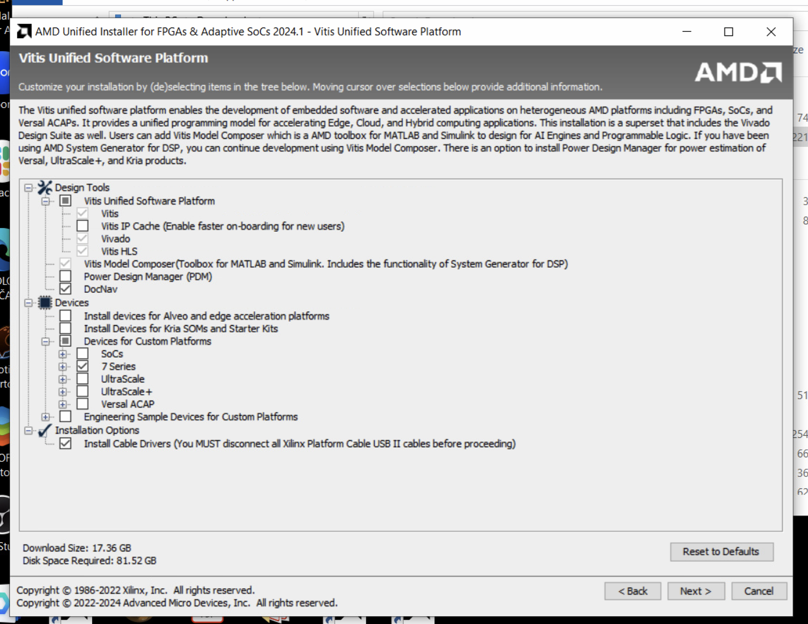
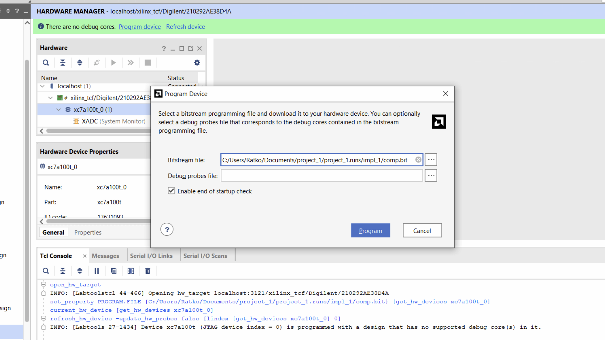

# Xilinx Vivado - Getting started 

Xilinx Vivado is a design suite used for the synthesis and analysis of HDL designs, specifically targeting Xilinx FPGAs and SoCs. It provides a comprehensive environment for design entry, simulation, synthesis, implementation, and debugging.

For Autumn 2025, we are using Vivado 2025.1; however, older versions will also be suitable for lab work.

## Download 

To install it, visit: [Downloads (xilinx.com)](https://www.xilinx.com/support/download.html)

- Download the Windows Self Extracting Web Installer:

- When you click on it, you will be prompted to create a Xilinx student account. Use your school email and a password to complete this step. You will need to provide your address and other details. This step is just a formality required to download the free version of Vivado.

- After logging into Xilinx with your newly created credentials, click the Download button to obtain the Web Installer.

- Once the Web Installer is downloaded, locate the EXE file in your “Downloads” directory and double-click it to run.
- The Web Installer download is quick, taking about a minute as it is only around 200 MB. However, the actual Vivado installation process will take longer. The installer will first download Vivado and then proceed with the installation. You typically need around 70 GB of free space for the installation. After the installation is complete, the installer will automatically remove unnecessary files, reducing the Vivado installation size to 20 GB.

## Installation

- Click on the installation file. When prompted by Windows with "Do you want to allow this app to make changes to your device?", select "Yes".
- If Windows Defender prompts you, click "Allow Access".

- You should see the Xilinx Unified Installer appear, indicating the version (e.g., 2022.2). When the Unified Installer launches, click "Next".
- Select "Download and Install". Enter your email and password for the Xilinx account you just created. Click "Next".

- Choose the “Vitis” option and click Next. 

- In the "Devices" section, select only the 7 Series and deselect the other options. While selecting all checkboxes will increase the file size and add support for more boards, for our lab purposes, we only need the Basys 3 board.

- The installer will show the progress. After a long time, it will download approximately 20GB of data and begin the installation. Follow the default options throughout the process. Once completed, you will find Vivado and Vitis icons on your desktop.

- You can see the icons of Vitis on your desktop. 

## Licensing (if required)

- Open Vivado 2024.1 program 
- From the Help menu, choose Manage License...(Vivado License Manager) 
 

- In the Get License tab, choose Obtain License. In Obtain License menu, **Get my Full or Purchased Certificate-Based License**

- Click on Connect Now. Then Sign into the Xilinx Licensing Site with User ID and Password that you created during the download process.
- On the Product Licensing page, choose Vivado Design Suite: HL WebPACK 2015 and Earlier License 
  

- Click on Generate Node-Locked License and finish generating your 
license.  
- Click Next and Next as you go. One copy of your license will be sent to your email account or you can download it directly from Product Licensing page – Manage Licenses tab. 
- Save your license file (.lic) to any folder on your computer and run Vivado License Manager. 
- Click on Load License under Get License tab and choose Copy License 
and upload the .lic file that you have downloaded. 
- Now you should see the activated WebPACK license in Vivado License 
Manager 

## Creating your first project 

- Click on File -> Project -> New. 

- Click Next, give name to your project and select directory.

- Select RTL project. If you do not have source files at this moment, select Do Not Specify Sources at this time. 

- Select default part. Chose following device properties

    - Category: General-Purpose 
    - Family: Artix-7 
    - Package: csg324
    - Speed: -1
    - Then select part xc7a7100tcsg324-1 for 100T version of Nexys A7, Nexys DDR 4, or NEXYS 4 or xc7a750tcsg324-1 for 50T version of Nexys A7

- Click Finish 

## Implementing your first design in Vivado 

- Create files by first navigating to Sources Window. 

- Right click on folder Design Sources then Add sources and create file. Select System Verilog type. 

- To add constraints[^1] right click on Uttility sources folder and repeat procedure. We will add the constraints files for your board:
  - [Nexys A7 50T](https://github.com/Digilent/digilent-xdc/blob/master/Nexys-A7-50T-Master.xdc), 
  - [Nexys A7 100T](https://github.com/Digilent/digilent-xdc/blob/master/Nexys-A7-100T-Master.xdc), 
  - [Nexys DDR4](https://github.com/Digilent/digilent-xdc/blob/master/Nexys-4-DDR-Master.xdc) or 
  - [Nexys 4](https://github.com/Digilent/digilent-xdc/blob/master/Nexys-4-Master.xdc)

[^1] More about constraints files can be found here: [Digilent reference](https://digilent.com/reference/programmable-logic/guides/vivado-xdc-file)

- After you succesfully implement the design, run generate Bitstream Generation under Project Manager Tab. (Left side)
  
- To program device, you need to open HW manager. After that click Open target and select Auto connect.
   
- After the target is opened, you can program it by clicking on Program device, which will ask you to select bitstream file. 

 
 

 - Congratulations, you successfully programmed the FPGA device. 

 
 
 
 
 

 

