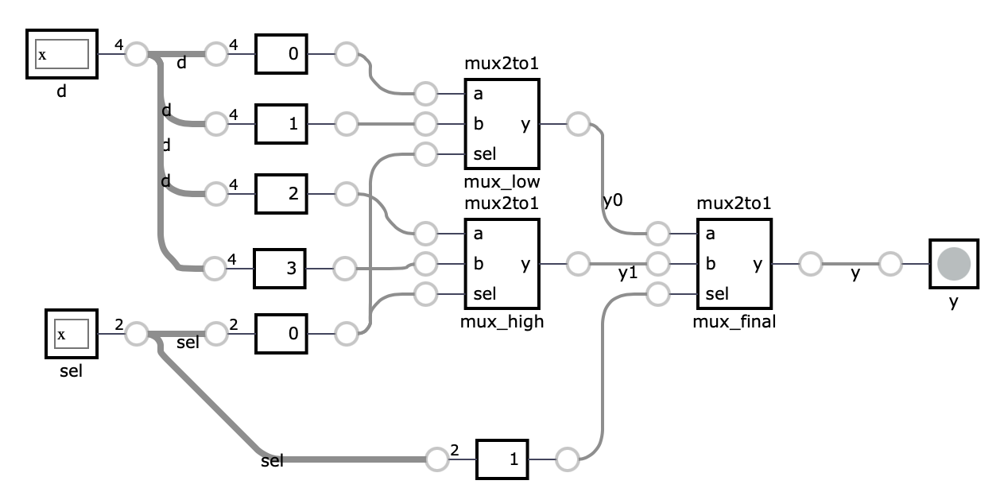

# Third exercise: Structural modeling and Simulation

In the previous exercise, we focused on designing counters or flip-flops by describing their functionality in SystemVerilog. This style of modeling is referred to as behavioral modeling. This exercise focuses on structural modeling, where we describe a module in terms of how it is composed of simpler modules. In the example below, we assemble a 4:1 multiplexer from three 2:1 multiplexers. Each copy of the 2:1 multiplexer is called an instance and has a unique name.

```verilog
module mux2to1 (
    input logic a,
    input logic b,
    input logic sel,
    output logic y
);
    assign y = sel ? b : a;
endmodule

module mux4to1 (
    input logic [3:0] d,
    input logic [1:0] sel,
    output logic y
);
    logic y0, y1;

    // instance mux_low of module mux2to1
    mux2to1 mux_low (
        .a(d[0]),
        .b(d[1]),
        .sel(sel[0]),
        .y(y0)
    );

    // instance mux_high of module mux2to1
    mux2to1 mux_high (
        .a(d[2]),
        .b(d[3]),
        .sel(sel[0]),
        .y(y1)
    );

    // instance mux_final of module mux2to1
    mux2to1 mux_final (
        .a(y0),
        .b(y1),
        .sel(sel[1]),
        .y(y)
    );
endmodule
```

As we can see, the instantiation of a module has following syntax: first, we specify the module name, followed by the instance name. In parentheses, we connect the module's inputs and outputs to signals defined at the current level of hierarchy. 

```verilog
// module name - mux2to1
// instance name - mux_final
// parenthesis - we map ports 
//             - .a(y0) - port a of module is connected to signal y0
mux2to1 mux_final (
        .a(y0),
        .b(y1),
        .sel(sel[1]),
        .y(y)
    );
// alternative, more C-like instation
// mux2to1 mux_final(y0,y1,sel[1],y)
```
The bellow image depicts the resulting design: 



## Parametrized components 

So far, all of our modules have had fixed-width inputs and outputs. SystemVerilog allows variable-width modules through the use of parameterized modules. The code below illustrates a parameterized counter module with a variable length output signal.


```verilog
module counter #(
    // Default value if we do ommit 
    // WIDTH parameter while instatiating module
    parameter WIDTH = 8
) (
    input logic clk,
    input logic reset,
    output logic [WIDTH-1:0] count
);
    logic [WIDTH-1:0] count_reg;

    always_ff @(posedge clk) begin
        if (reset) begin
            count_reg <= 0;
        end else begin
            count_reg <= count_reg + 1;
        end
    end

    assign count = count_reg;
endmodule
```
This module defines a counter with a parameterized width. To instatiate in a another module, we need to do following: 

```verilog
module top(
    input logic clk,
    input logic reset,
    input logic [15:0] count);

    // Instantiate the counter with a width of 16
    counter #(
        .WIDTH(16)
    ) counter_inst (
        .clk(clk),
        .reset(reset),
        .count(count)
    );
endmodule
```
To define parameters inside a module, we can use local parameters (`localparam`). Verilog HDL local parameters are identical to parameters except that they cannot be directly modified by `defparam` statements or module instance parameter value assignments. 

```verilog
    ....
    localparam CNT_WIDTH = 16;

    // Instantiate the counter with a width of 16
    counter #(
        .WIDTH(CNT_WIDTH)
    ....
```

## Testbenches 

A testbench is an HDL module used to test another module, known as the device under test (DUT) or unit under test (UUT). The testbench includes statements to apply inputs to the DUT and, ideally, to verify that the correct outputs are generated. The input and expected output patterns are referred to as test vectors.

Let us write the DUT for our 4:1 MUX. Lets fix length to 4-bit.

```verilog
module tb_mux4to1;

    // Testbench signals
    logic [1:0] sel;
    logic y;

    // Instantiate the DUT
    mux4to1 dut (
        .d(d),
        .sel(sel),
        .y(y)
    );

    // Test procedure
    initial begin
        // Test case 1
        // Define values for inputs  
        d = 4'b1010; sel = 2'b00;
        // Wait for 10 time units 
        #10;
        // print on STD 
        $display("d=%b sel=%b y=%b", d, sel, y);

        // Test case 2
        d = 4'b1010; sel = 2'b01;
        #10;
        $display("d=%b sel=%b y=%b", d, sel, y);

        // Test case 3
        d = 4'b1010; sel = 2'b10;
        #10;
        $display("d=%b sel=%b y=%b", d, sel, y);

        // Test case 4
        d = 4'b1010; sel = 2'b11;
        #10;
        $display("d=%b sel=%b y=%b", d, sel, y);

        // Finish simulation
        $finish;
    end
endmodule
```

For testing sequential design, we need to account the clock signal. In testbenches we need to create a separate always block that will generate clock signal. Bellow code shows the testbench for our parametrized counter (case for 4-bit).

```verilog
module tb_counter;

    // Testbench signals
    logic clk;
    logic reset;
    logic [3:0] count;

    // Instantiate the DUT
    counter #(
        .WIDTH(4)
    ) dut (
        .clk(clk),
        .reset(reset),
        .count(count)
    );

    // Clock generation
    always begin
        #5 clk = ~clk; // Toggle clock every 5 time units
    end

    // Test procedure
    initial begin
        // Initialize signals
        clk = 0;
        reset = 1;
        // Apply reset
        #10;
        reset = 0;
        // Wait for some time and observe the count
        #100;
        $display("count=%b", count);
        // Finish simulation
        $finish;
    end
endmodule
```

#### How to add simulation files in Vivado 

1. Add testbench to folder *Simulation Sources*

> **Note:** the testbench is .sv file. Active TB will be highlighted with bold. 


2. Run simulation: Click *Run Simulation*


<!--
## Task: Implement a 4-bit Gray counter

Modify the code from previous exercise, in such a way that design relies on following modules:

| Name       | Generic Parameters | Additional Functionality                  |
|------------|--------------------|-------------------------------------------|
| prescaler  | WIDTH (the width of the counter)           | None           |
| binary_counter | WIDTH  (the width counter)           | Counting frequency: 0.5 Hz and 10 Hz               |
| code_output | WIDTH  (the width output)           |    Selecting if the output is in Gray Code or Binary code     |

--->


## Task: Implement a PWM (Pulse-Width Modulation) module for RGB LED

In this task, you will implement a PWM module for an RGB LED. The module will have three 6-bit inputs, each controlling the duty cycle of the red, green, and blue LEDs. The module will have three 1-bit outputs, each representing the PWM signal for the red, green, and blue LEDs. 

The PWM signal will be generated by comparing the duty cycle with a 4-bit counter that increments with the PWM_tick signal. The PWM_tick signal is generated by a prescaler that outputs a pulse every 3125 clock cycles, corresponding to a frequency of 32 kHz. You will connect the PWM module to the prescaler and the RGB LED module according to the diagram below.


Switch values denote duty cycle for each color. The duty cycle is calculated as follows: 

| SW[1:0] | Duty_cycle |
|---------|------------|
| 00      | 0 %        |
| 01      | 12.5 %     |
| 10      | 25 %       |
| 11      | 50 %       |

Duty cycle is definied as ratio of high signal to the period of the signal, e.g. 25% duty cycle means that the signal is high for 25% of the period.

### PWM time diagram


### Hints

- You can reuse the prescaler module from lectures. Make sure to set the prescaler to output a pulse every 3125 clock cycles.

- The PWM module should consists of a 4-bit counter. The counter increments with the PWM_tick signal from the prescaler. To generate the PWM signals for each color, compare the counter value with the corresponding duty cycle input. If the counter value is less than the duty cycle, set the output high; otherwise, set it low.

- Employ structural modeling to connect the prescaler and PWM modules. The draft SV file is provided in the repository.

- Create a testbench to verify the functionality of your PWM module. The testbench is provided in the repository.

### Pin mapping 

Connect the `clk` signal to the system clock (100 MHz), the `rst` signal to the middle button, the `up_down` signal to the switch, and the `gray_code` signal to the LEDs.

```tcl
## Clock signal
set_property -dict { PACKAGE_PIN E3    IOSTANDARD LVCMOS33 } [get_ports { clock }]; #IO_L12P_T1_MRCC_35 Sch=clk100mhz
create_clock -add -name sys_clk_pin -period 10.00 -waveform {0 5} [get_ports {clock}];


##Switches
set_property -dict { PACKAGE_PIN J15   IOSTANDARD LVCMOS33 } [get_ports { SW[0] }]; #IO_L24N_T3_RS0_15 Sch=sw[0]
set_property -dict { PACKAGE_PIN L16   IOSTANDARD LVCMOS33 } [get_ports { SW[1] }]; #IO_L3N_T0_DQS_EMCCLK_14 Sch=sw[1]
set_property -dict { PACKAGE_PIN M13   IOSTANDARD LVCMOS33 } [get_ports { SW[2] }]; #IO_L6N_T0_D08_VREF_14 Sch=sw[2]
set_property -dict { PACKAGE_PIN R15   IOSTANDARD LVCMOS33 } [get_ports { SW[3] }]; #IO_L13N_T2_MRCC_14 Sch=sw[3]
set_property -dict { PACKAGE_PIN R17   IOSTANDARD LVCMOS33 } [get_ports { SW[4] }]; #IO_L12N_T1_MRCC_14 Sch=sw[4]
set_property -dict { PACKAGE_PIN T18   IOSTANDARD LVCMOS33 } [get_ports { SW[5] }]; #IO_L7N_T1_D10_14 Sch=sw[5]

##Buttons
set_property -dict { PACKAGE_PIN N17   IOSTANDARD LVCMOS33 } [get_ports { reset }]; #IO_L9P_T1_DQS_14 Sch=btnc

## RGB LEDs
set_property -dict { PACKAGE_PIN R12   IOSTANDARD LVCMOS33 } [get_ports { RGB[2] }]; #IO_L5P_T0_D06_14 Sch=led16_b
set_property -dict { PACKAGE_PIN M16   IOSTANDARD LVCMOS33 } [get_ports { RGB[1] }]; #IO_L10P_T1_D14_14 Sch=led16_g
set_property -dict { PACKAGE_PIN N15   IOSTANDARD LVCMOS33 } [get_ports { RGB[0] }]; #IO_L11P_T1_SRCC_14 Sch=led16_r
```
