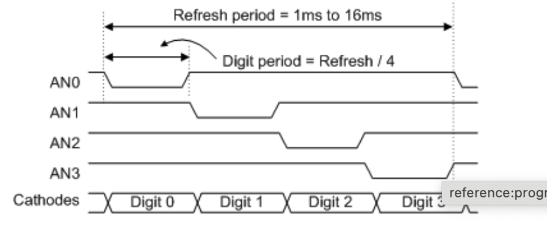
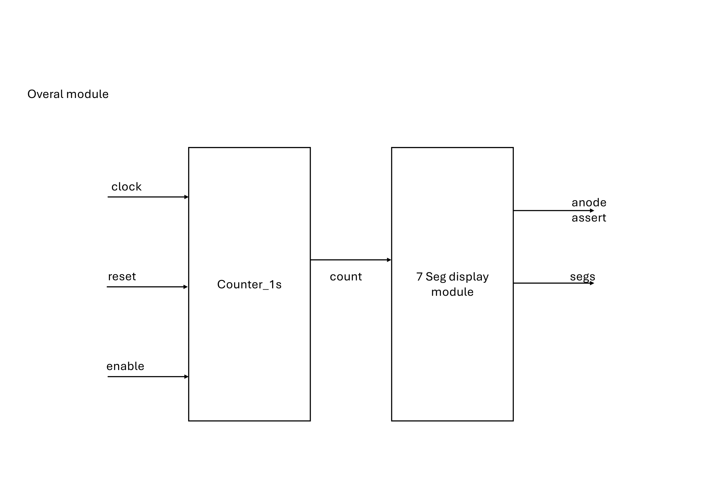

# Fourth exercise: Counter and seven segment display 


## Seven segment display 

A seven-segment display is an electronic display device used to display decimal numerals and some alphabetic characters. It is composed of seven LEDs (hence its name) arranged in a rectangular fashion. Each of the seven LEDs is called a segment because when illuminated, it forms part of a numeral (both decimal and hexadecimal) to be displayed.

Here is a typical layout of a seven-segment display:

```
 --A--
|     |
F     B
|     |
 --G--
|     |
E     C
|     |
 --D--
```

Each segment is labeled with a letter from A to G. By turning on different combinations of these segments, you can display numbers from 0 to 9 and some letters.

### Common anode vs common cathode Configuration
In a common anode (CA) configuration, all the anodes (positive terminals) of the LEDs are connected together and to a common voltage source, typically Vcc. To light up a segment, you need to connect its cathode (negative terminal) to ground (GND) through a current-limiting resistor. This means that the segments are turned on by applying a LOW signal (0V) to the cathodes.

In a common cathode (CC) configuration, all the cathodes (negative terminals) of the LEDs are connected together and to a common ground (GND). To light up a segment, you need to connect its anode (positive terminal) to a voltage source (Vcc) through a current-limiting resistor. This means that the segments are turned on by applying a HIGH signal (Vcc) to the anodes.


| Configuration | Description |
|---------------|-------------|
| **Common Anode (CA)** | All anodes are connected to Vcc. Segments are lit by grounding the cathodes. |
| **Common Cathode (CC)** | All cathodes are connected to GND. Segments are lit by applying Vcc to the anodes. |

### Nexys A7 and Seven segment display 

- The Nexys A7 contains eight 7-segment displays in common anode configurations.
- All eight 7-segment displays share the cathode signals (CA to CG); however, each has separate anode signals (AN7 to AN0).
    - To display eight symbols on the 7-segment displays, time multiplexing is required.
    - The circuit drives the anode signals and corresponding cathode patterns of each digit in a repeating, continuous succession at an update rate faster than the human eye can detect.
    - Each digit appears only 1/8 of the time, but due to the persistence of vision, our eyes perceive all displays as being continuously on.
    - The time multiplexing process can be illustrated with the following image:
        - In the first segment, AN0 has a low value, selecting the first display. During this time segment, the first digit is shown. The high values for the rest of the anode signals deactivate the other displays.
        - In the second segment, AN1 has a low value, selecting the second display. During this time segment, the second digit is shown.

> **Note:** Although the 7-segment displays are in a common anode configuration, to select the appropriate 7-segment display, we need to set ANX (X = 0,...,7) to a low level. The ANX signals do not connect directly to the common anode signal of the 7-segment display but control transistors that act as switches. When ANX is set to low, the transistor turns ON, connecting the supply to the appropriate 7-segment display. Refer to Figure 9.1 in the [reference manual](https://digilent.com/reference/programmable-logic/nexys-a7/reference-manual).

 


## Assignment 


In this assignment, you will implement second counter using the Nexys A7 board. The counter will be displayed on the eight-digit seven-segment

The design will consist of the following modules:
- **Counter 1 s**
- **SevSegDisplay**

### Counter 1 s

The counter module will output a pulse every 1 seconds. The module will have the following inputs and outputs:

- **Inputs**:
    - `clock`: 100 MHz clock signal.
    - `reset`: Asynchronous reset signal.
    - `start`: When active, enables counting.
- **Outputs**:
    - `pulse`: A pulse signal that goes high every 1 seconds.


Interface of the module:

```verilog
module timer_1s // General Purpose counter        
    #(parameter PRESCALER_WIDTH = 32,
      parameter LIMIT = 100000000)
    (
        input logic clock,
        input logic reset,
        input start,
        output logic time_tick
    );

    // implement the counter that counts from 0 t0 LIMIT-1, when start is high
    // the counter width is PRESCALER_WIDTH
    // when the counter reaches LIMIT, time_tick should be high for one clock cycle

endmodule
```


### SevSegDisplay module

The SevSegDisplay module will take the counter values from all the mod_counter modules and display them on the seven-segment display. The module will have the following inputs and outputs:

```verilog
module SevSegDisplay (
    input logic clock,
    input logic reset,
    input logic [3:0] digit1, // Least significant digit
    input logic [3:0] digit2, // Next digit
    input logic [3:0] digit3, // Next digit
    input logic [3:0] digit4,
    input logic [3:0] digit5,
    input logic [3:0] digit6,
    input logic [3:0] digit7,
    input logic [3:0] digit8, // Most significant digit
    output logic [7:0] anode_select,
    output logic [6:0] segs
);

    logic [31:0] digit;

    assign digit = {digit8, digit7, digit6, digit5, digit4, digit3, digit2, digit1};

endmodule
```


 The module consists of following modules:

#### Counter 0.002s module

The counter module will output a pulse every 0.002 seconds. You can use the timer_1s module to implement this module. Just change the limit parameter accordingly.

#### Anode selector module

The anode selector module will select the appropriate 7-segment display to show the current time. You can implement this module using a 3-bit counter. The counter will increment every 0.002 seconds. When the counter reaches 8, it will reset to zero. The output of the module will be a 8-bit signal that equals to negated value of (1 << counter). 

```verilog
module anode_assert (
    input logic clock, // 100 MHz
    input logic reset, 
    input logic clock_enable, // will be high every 0.002 seconds
    output logic [7:0] anode_select // 8-bit signal, look at  the image in section Nexys A7 and Seven segment display 
);

    // counter that counts from 0 to 7
    logic [2:0] count;

    // implemet the 3-bit counter which counts when clock_enable is high

    // assert anode_select
    assign anode_select = ~(1 << count);
    
endmodule
```

#### value_to_digit module

The `value_to_digit` module will select one digit from 8 digits to display it on current 7-segment display. Implement the module using the following interface:

```verilog
module value_to_digit(
    input logic [31:0] value,
    input logic [7:0] anode_select,
    output logic [3:0] digit
);
    
    // if anode_select is 0xFE, then digit is equal to value[3:0]
    // if anode_select is 0xFD, then digit is equal to value[7:4]
    // if anode_select is 0xFB, then digit is equal to value[11:8]
    // if anode_select is 0xF7, then digit is equal to value[15:12]
    // if anode_select is 0xEF, then digit is equal to value[19:16]
    // if anode_select is 0xDF, then digit is equal to value[23:20]
    // if anode_select is 0xBF, then digit is equal to value[27:24]
    // if anode_select is 0x7F, then digit is equal to value[31:28]
endmodule
```

#### digit_to_segments module

The `digit_to_segments` module will convert the digit to the segments that need to be turned on to display the digit on the seven-segment display. 

```verilog

module digit_to_segments (
    input logic [3:0] digit,
    output logic [6:0] segs
);
    // if digit is 0, then segs is 7'b1000000
    // if digit is 1, then segs is 7'b1111001
    // etc.

endmodule
```

### Top module

The top module will instantiate the `counter_1s`, `anode_assert`, `value_to_digit`, and `digit_to_segments` modules, and connect them together. The top module will also contain the logic for enabling the counter by using enable signal connected to `SW0` and reset the counter using `button BTNC`. The top module will have the following inputs and outputs:

```verilog
module top (
    input logic clock,
    input logic reset,
    input logic enable,
    output logic [7:0] anode_assert,
    output logic [6:0] segs
);

endmodule
```

## Conceptual Schematic

### 7 segment display 


### Top module 



### Constraints
```verilog
## Clock signal
set_property -dict { PACKAGE_PIN E3    IOSTANDARD LVCMOS33 } [get_ports { clock }]; #IO_L12P_T1_MRCC_35 Sch=clk100mhz
create_clock -add -name sys_clk_pin -period 10.00 -waveform {0 5} [get_ports {clock}];

##Switches
set_property -dict { PACKAGE_PIN J15   IOSTANDARD LVCMOS33 } [get_ports { enable }]; #IO_L24N_T3_RS0_15 Sch=sw[0]

##7 segment display
set_property -dict { PACKAGE_PIN T10   IOSTANDARD LVCMOS33 } [get_ports { segs[0] }]; #IO_L24N_T3_A00_D16_14 Sch=ca
set_property -dict { PACKAGE_PIN R10   IOSTANDARD LVCMOS33 } [get_ports { segs[1] }]; #IO_25_14 Sch=cb
set_property -dict { PACKAGE_PIN K16   IOSTANDARD LVCMOS33 } [get_ports { segs[2] }]; #IO_25_15 Sch=cc
set_property -dict { PACKAGE_PIN K13   IOSTANDARD LVCMOS33 } [get_ports { segs[3] }]; #IO_L17P_T2_A26_15 Sch=cd
set_property -dict { PACKAGE_PIN P15   IOSTANDARD LVCMOS33 } [get_ports { segs[4] }]; #IO_L13P_T2_MRCC_14 Sch=ce
set_property -dict { PACKAGE_PIN T11   IOSTANDARD LVCMOS33 } [get_ports { segs[5] }]; #IO_L19P_T3_A10_D26_14 Sch=cf
set_property -dict { PACKAGE_PIN L18   IOSTANDARD LVCMOS33 } [get_ports { segs[6] }]; #IO_L4P_T0_D04_14 Sch=cg
#set_property -dict { PACKAGE_PIN H15   IOSTANDARD LVCMOS33 } [get_ports { DP }]; #IO_L19N_T3_A21_VREF_15 Sch=dp
set_property -dict { PACKAGE_PIN J17   IOSTANDARD LVCMOS33 } [get_ports { anode_assert[0] }]; #IO_L23P_T3_FOE_B_15 Sch=an[0]
set_property -dict { PACKAGE_PIN J18   IOSTANDARD LVCMOS33 } [get_ports { anode_assert[1] }]; #IO_L23N_T3_FWE_B_15 Sch=an[1]
set_property -dict { PACKAGE_PIN T9    IOSTANDARD LVCMOS33 } [get_ports { anode_assert[2] }]; #IO_L24P_T3_A01_D17_14 Sch=an[2]
set_property -dict { PACKAGE_PIN J14   IOSTANDARD LVCMOS33 } [get_ports { anode_assert[3] }]; #IO_L19P_T3_A22_15 Sch=an[3]
set_property -dict { PACKAGE_PIN P14   IOSTANDARD LVCMOS33 } [get_ports { anode_assert[4] }]; #IO_L8N_T1_D12_14 Sch=an[4]
set_property -dict { PACKAGE_PIN T14   IOSTANDARD LVCMOS33 } [get_ports { anode_assert[5] }]; #IO_L14P_T2_SRCC_14 Sch=an[5]
set_property -dict { PACKAGE_PIN K2    IOSTANDARD LVCMOS33 } [get_ports { anode_assert[6] }]; #IO_L23P_T3_35 Sch=an[6]
set_property -dict { PACKAGE_PIN U13   IOSTANDARD LVCMOS33 } [get_ports { anode_assert[7] }]; #IO_L23N_T3_A02_D18_14 Sch=an[7]

##Buttons
set_property -dict { PACKAGE_PIN N17   IOSTANDARD LVCMOS33 } [get_ports { reset }]; #IO_L9P_T1_DQS_14 Sch=btnc
```

## Testbench

Employ testbenches to verify the functionality of the modules.


