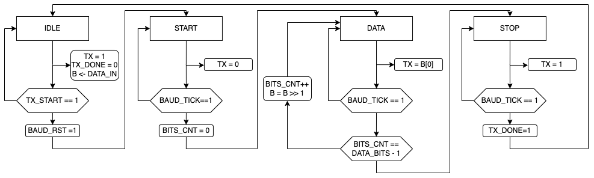

# Sixth exercise: Building a UART transmitter
  
## UART frame 

A UART frame consists of several key components that ensure proper data transmission:

1. **Start Bit**: The frame begins with a start bit, which is typically a low signal (0). This bit signals the receiving UART that a new byte of data is coming.

2. **Data Bits**: Following the start bit, the actual data bits are transmitted. The number of data bits can vary, commonly being 5 to 9 bits long. These bits represent the actual data being sent.

3. **Parity Bit (Optional)**: After the data bits, an optional parity bit may be included for error checking. The parity bit can be even, odd, or none, depending on the configuration. It helps in detecting errors in the transmitted data.

4. **Stop Bits**: The frame ends with one or more stop bits, which are typically high signals (1). Stop bits indicate the end of the data frame and allow the receiving UART to recognize the end of the byte. Common configurations include 1, 1.5, or 2 stop bits.

The structure of a UART frame ensures that the receiving device can correctly interpret the incoming data, synchronize with the start bit, and verify the integrity of the data using the parity and stop bits.

 

The next image illustrates the flow of bits through UART channel 

 
## Building a UART transmitter system

### Baud rate generator 

Implement the baud rate generator module in SystemVerilog. Implement the module as counter that generates the pulse signal, when the counter reaches the value of the desired baud rate. The desired value is expressed as ratio between `SYSTEM_CLOCK_FREQUENCY` and `BAUD_RATE`. 
```
LIMIT = SYSTEM_CLOCK_FREQUENCY / BAUD_RATE
```
`LIMIT` is the value that the counter should reach to generate the pulse signal. 

The interface of the module should be as follows: 
```systemverilog
module baud_rate_generator // General Purpose counter        
    #(parameter PRESCALER_WIDTH = 4,
      parameter LIMIT = 11)
    (
        input logic clock,
        input logic reset,
        output logic baud_rate_tick
    );

    logic [PRESCALER_WIDTH-1:0] count;

    // when the counter reaches the limit, the sample_tick signal is generated
endmodule
```

### FSM development in SystemVerilog 

Implement a UART transmitter using a Finite State Machine (FSM) in SystemVerilog. When sending message disregard the parity bit. 

The interface of UART transmitter should be following: 

```systemverilog
module uart_fsm #(
    parameter DATA_WIDTH = 8
) (
    input logic clock,
    input logic reset,
    input logic [DATA_WIDTH-1:0] data_in,
    input logic baud_rate_tick,
    input logic tx_start,
    output logic tx,
    output logic tx_done,
    output logic baud_rst // used for baud rate generator reset
);

endmodule
```

The AFSM diagram that implements state machines is following 

    

### Transmitter module 

The overall system should be connected as follows: 

   

## Building a state machine for sending string 

Implement a FSM that will interface with UART transmitter system in order to send following string.
```
Hello World!
```
The string should be sent when button `BTNC` is pressed.

Tip: 
- Use the ASCII table to convert characters to binary.
- Each character represent a separate state in the FSM.
- Use the `tx_done` signal to move to the next state.


## UART and Nexys A7 board

The UART transmitter can be connected to the Nexys A7 board using the USB-UART bridge. The TX signal of the USB-UART bridge is connected to D4 pin of the Nexys A7 board. The connection is shown in the following image:

   


When implementing the module, disregard the RTS and CTS signal. 
